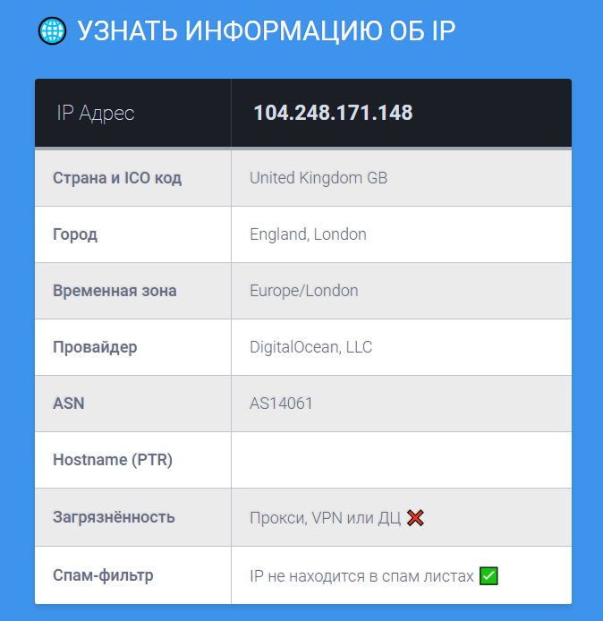
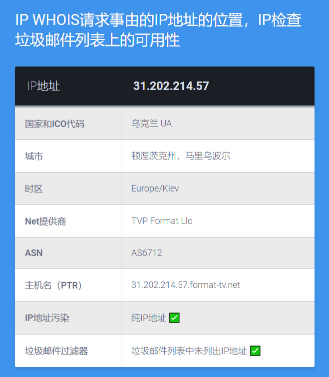

# IP Info
> Узнать информацию об IP (IP Whois) / IP WHOIS请求事由的IP地址的位置，IP检查垃圾邮件列表上的可用性

[![NPM Version][npm-image]][npm-url]
[![Build Status][travis-image]][travis-url]
[![Downloads Stats][npm-downloads]][npm-url]

[RUS] Получение информации об IP адресе из различных источников c переводом на Русском и Китайском(ZH) языках.
Скрипт был написан в качестве тренировки для изучения механизмов работы RestAPI, а также JavaScript и немного вёрстки) 
Не судите строго, я только учусь ^_^.

[CN] 从各种来源获取有关单个IP地址的信息。
这个脚本是为了研究RestAPI的机制，以及JavaScript和一些布局而编写的。不要严格判断，我只是在学习^_^。

| Русская версия  | 中文版 |
| ------------- | ------------- |
|   |   |

## Установка / Install

0. Если у вас нет хостинга, вы можете получить хороший бесплатный хостинг [здесь (Beget)](https://beget.com/ru/free-hosting).
1. Залейте файл `ipinforuv1.html` на хостинг по FTP или через файловый менеджер.
2. Откройте страничку по адресу: `https://ваш_адрес_сайта/ipinforuv1.html`
3. Готово :)

## 建立

0. 如果您没有托管服务，您可以获得一个的免费托管服务[Wonzan注册](http://www.wonzan.com/page/7.html)
1. 通过FTP或文件管理器在托管服务上填写文件`ipinfocnv1.html`。
2. 打开页面到地址：`https://yours_site_address/ipinfocnv1.html`
3. 安装完成:)

## Usage example / Примеры использования

* Используйте это в качестве создания своего сервиса для получения информации об IP адресах посетителей.
* Используйте это чтобы сделать Whois сервис, можете добавить рекламу или просто дальше развивать свой сервис.
* Можно встроить таблицу в готовый сайт, для добавления функционала, например, чистоты IP.
* Любой другой пример, на что способна ваша фантазия :3

## 几个使用的例子

* 使用此作为服务的创建，以获取有关访问者IP地址的信息。
* 使用此功能进行whois服务，您可以添加广告或只是进一步开发您的服务。
* 您可以在完成的站点中嵌入表格，以添加功能，例如IP纯度。
* 你的想象能力的任何其他例子：3

## Release History / 发布历史 / Релизы

* 0.0.1
    * [RUS] Первая версия скрипта, тестовый билд. 
    * [CN] 脚本的第一个版本，测试版本。

## Meta

Mikhail – [@juniorDEV](https://t.me/juniordev) – Firelance@yandex.ru

Distributed under the MIT license. See ``LICENSE`` for more information.

[https://github.com/jun-dev/ipinfo](https://github.com/jun-dev/)

## Contributing

1. Fork it (<https://github.com/jun-dev/ipinfo/fork>)
2. Create your feature branch (`git checkout -b jun-dev/ipinfo`)
3. Commit your changes (`git commit -am 'Add some fooBar'`)
4. Push to the branch (`git push origin jun-dev/ipinfo`)
5. Create a new Pull Request

<!-- Markdown link & img dfn's -->
[npm-image]: https://img.shields.io/npm/v/datadog-metrics.svg?style=flat-square
[npm-url]: https://npmjs.org/package/datadog-metrics
[npm-downloads]: https://img.shields.io/npm/dm/datadog-metrics.svg?style=flat-square
[travis-image]: https://img.shields.io/travis/dbader/node-datadog-metrics/master.svg?style=flat-square
[travis-url]: https://travis-ci.org/dbader/node-datadog-metrics
[wiki]: https://github.com/yourname/yourproject/wiki
